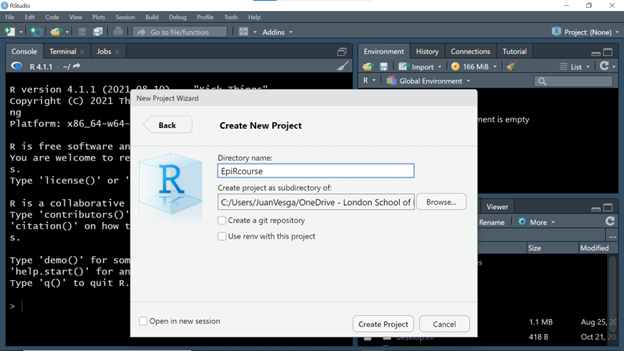
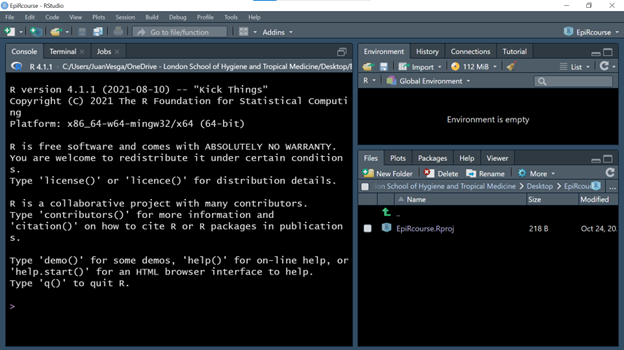
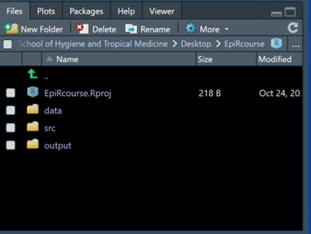

 
In this first practical we will aim to set us up with installing R and RStudio (if you have not done so yet!), familiarize with the RStudio environment and explore a first hands-on experience in creating an R project. This is the first step to create reproducible and meaningful code in R.
 
## 1. Installing R and Rstudio
 
As mentioned in our lecture, R and R studio are available for free. Follow the next simple step:
 
1.  Go to <https://www.r-project.org/>
 
2.  Follow the CRAN link
 
3.  From the list of country mirrors available to download the software, choose any of the repositories available for Turkey (any link will do)
 
4.  At the top of the page, options will appear to "Download R" for Mac, Windows or Linux. Click the one relevant to you.
 
5.  When the new window appears choose "base R"
 
6.  In a new window, a link to "Download R 4.1.1...." will appear, click and download
 
7.  Install the downloaded software in your machine
 
8.  Go to <https://www.rstudio.com/products/rstudio/download/>
 
9.  From the table of options to download, choose the first one "RStudio Desktop"
 
10. In the next window, click the link prompting you to download RStudio.
 
11. Once downloaded, install in your machine
 
## 2. Configuring the R project
 
We are now ready to start working on R. From now on we will only interact with the RStudio interface, and not with R itself. Remember that RStudio is a nice wrapper that runs R in the background, but makes things a little bit friendlier. However, if you want to explore R and how it looks without RStudio, go ahead and open an instance of R and explore it!
 
### 2.1. How do we work in R?
 
There are at least two ways in which you can organize your workflow in R:
 
1.  Creating an R script in any folder you like and just adding the code you need and storing and calling your data from specific folder paths
 
2.  Create an R project with a folder structure. This project contains all the data, source code and output of your R project
 
You can choose any of the above, but I strongly suggest to choose option two, as it allows you to organize your files and deal easily with file paths.
 
Whichever your choice, working in R is not too different from working with other common software, like Word or PowerPoint. This is, you create files that we call "scripts" and these scripts have an extension " .R " that identifies them as being R files. This sounds obvious and easy, but it is important to organize your workflow. All this means that, whenever you create an R script, you can always go back to the file you created, click on it and it will open a new RStudio session with your file open at start. Just as you would do with Word or PowerPoint, for example.
 
### 2.2. Create a new R project
 
One of the great advantages of using RStudio is the possibility of using Projects in R (R Project) (indicated by a .Rproj file) which allows organizing the workspace, history and source files.
 
To create an Project in R, follow these steps:
 
1.  Open RStudio and in the upper left corner, select the File -\> New Project... tab.
 
2.  A "New Project Wizard" window will appear, now select "New Directory".
 
3.  In the Project Type window, create a new project in Rstudio by selecting New Project -\> Create New Project, in the Directory Name box put the name "EpiRcourse".
 

 
4.  Select the Browse... button, now you should create a folder that will serve as a repository for your project, as well as the sub folders you need to organize your work (for example: data, scripts, figures). At the end select the folder that will serve as the repository. In the end, your project should look like this image:
 

 
### 2.3. Organize your folder structure
 
You have now created an empty R project. You can try closing your RStudio session and open it again, but this time, do it so by going to the folder you created and double click in the "EpiRcourse.Rproj" object. It should open again the same environment.
 
Now is time to organize the folder structure you will use to run and organize your R scripts and data. It is good practice to have your data, source files and output in separate folders. Try creating these three folders, namely "data", "src" and "output".
 
In the lower-right quadrant of your session click in the "New Folder" icon. Cretae the three folders. Your "Files" window should look like this:
 

 
The "data" folder will store the data files you need to run your project. The "src" folder will host all the R scripts (source files) containing R functions and helping script, and the "output" folder will contain your results and figures.
 
This is a suggested structure and you should adapt it according to your needs in every new project.
 
### 2.4. Create your first R script
 
Now you have an R project, a folder structure and you are ready to start coding!.
 
You should have noticed the big Console window on the left. The R console is a direct window to interact with R engine. Try and do some simple operations, for example, 1+2 or 4\*4 . Check the results.
 
As you see, it runs all the operations at your command. But in the long term you need a file to keep track of your analysis and data manipulation. In brief, a script is a plane file where you write the sequence of operations and algorithms. Let's create one:
 
1.  Go to the "File" tab in the left upper corner
 
2.  Select, "New File" -\> "R Script"
 
You will notice that a new empty window with header "Untitled 1" has been created. This is your script. Try writing simple operations in it.
 
Save the script in the same folder where the project object lives. Call it "day1_introScript". In the next practical we will use this same script to put practice concepts of R syntax, R objects, basic operations and functions.
