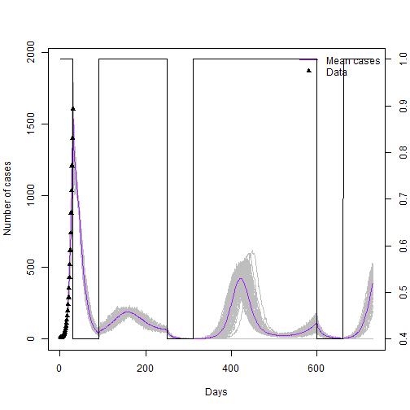

---
type: assignment
date: 2018-09-26T4:00:00+4:30
title: '5. Gün Final projesi: COVID-19'
pdf: /static_files/assignments/15_final_project_covid19.pdf
attachment: /static_files/assignments/daily_cases_countryX.csv
#solutions: /static_files/assignments/asg_solutions.pdf
due_event: 
    type: due
    date: 2018-11-13T23:59:00+3:30
    description: 'Assignment #1 due'
--- 
 
Bu **son projede** kursta bu zamana kadar öğrenilen kavramların çoğunu uygulamaya koyacağız. Bu uygulamanın sonunda SARS-CoV2'nin bulaşması ile ilgili bir model tanımlayabilmeli ve çalıştırabilmelisiniz, bunun ana sonuçlarını yorumlayabilmelisiniz ve müdahaleleri simüle edebilmelisiniz
 
## 1. SARS-CoV2'nin bulaşması ile ilgili başlangıç modeli
 
Ülkenizde salgın kontrol sorumlusu olarak sizden önümüzdeki iki yıl için COVID-19'un olası popülasyon etkisine ait bir projeksiyon sunmanız istendi. Ana epidemiyolojik göstergelere ait ilk tahminler size verilmişti. Aşağıdaki bilgilere bakın:
 
-   Popülasyon boyutu = 100,000
-   Tahmin edilen R0 = 1,4 - 3,9
-   Kuluçka dönemi = 5,1 gün
-   Semptom geliştirenlerin yüzdesi = %50
-   Bulaştırıcılık döneminin süresi = 2-7 gün
-   Kazanılan bağışıklığın süresi = 1 yıl
 
Stokastik etkilerin, salgının sona erme veya daha da artma ihtimalini değerlendirmede önemli bir rolü olabileceği anlaşılmaktadır.
 
**Görev 1:** Önceki bir SIR stokastik modelini şablon olarak kullanmak başlangıç projeksiyonu oluşturmak ve uygulamak için gerekli kodu yeniden düzenlemeye yardımcı olun.  

**Not:** Aşağıdaki kod önceden uyarlanmıştır ancak kodu çalıştırmak için **??** sembolüyle işaretlenmiş bazı boşlukların doldurulması gerekir.

 


library(odin)
library(ggplot2)
library(reshape2)
library(dplyr)
library(here)
set.seed(1)
 
seir_generator <- odin::odin({
  ## Bölmeler arasında geçişler için temel denklemler:
  update(S) <- S - n_SE + n_RS + n_bd
  update(E) <- ?? #<------Kuluçka bölmesine ihtiyacımız var! compartment! 
  update(I) <- I + n_EI - n_IR
  update(R) <- R + n_IR - n_RS
  
  output(cases) <- n_EI * psymp
  ## Bireysel geçiş olasılıkları:
  p_SE <- 1 - exp(-beta * I / N) # S to E
  p_EI <- 1 - exp(-omega)        # E to I
  p_IR <- 1 - exp(-gamma)        # I to R
  p_RS <- 1 - exp(-delta)        # R to S
  
  ## Bölmeler arasında değişen sayıları tanımlamak için binom dağılımlardan çekin:
  n_SE <- rbinom(S, p_SE)
  n_EI <- rbinom(E, p_EI)
  n_IR <- rbinom(I, p_IR)
  n_RS <- rbinom(R, p_RS)  
  n_bd <- N*birth_rate/365
  
  ## Toplam popülasyon boyutu
  N <- ?? #<- Toplam popülasyon boyutu
  
  # beta'yı R0'a göre tanımlayın
  beta <- ?? #<- Beta R0'a göre yeniden tanımlansın mı? (ipucu: enfeksiyon süresi oranı nedir?) 
 
  
  ## Başlangıç durumları:
  initial(S) <- S_ini
  initial(E) <- E_ini
  initial(I) <- I_ini
  initial(R) <- 0
  
  ## User defined parameters - default in parentheses:
  S_ini <- user(1000)
  E_ini <- user(1)
  I_ini <- user(0)
  R0    <- user(2)
  gamma <- user(0.1)
  delta <- user(0.08)
  omega <- user(0.2)
  birth_rate <- user(0.0137)
  psymp <- user(0.5)
  
}, verbose = FALSE)

 
Modelinizi geliştirdiniz, bazı parametrelerle model nesnesi oluşturmaya çalışın ve başlangıç projeksiyonunu çalıştırın.
 
**Görev 2:** Başlangıçta verilen bilgilere göre parametre değerlerini tanımlayın ve verilen kodu uygulayarak kodu çalıştırın
 

 


N<-?? # Popülasyon boyutu
 
# Özel parametrelerle SEIR nesnesini çağırın 
seir <- seir_generator$new(
  S_ini=N-round(0.001*N), 
  E_ini = round(0.001*N), 
  R0= ??,    # R0
  gamma=??,  # Incubation period rate
  delta=??,  # Acquired immunity loss rate
  omega=??,  # Infectious period rate
  psymp=??)  # Fraction developing symptoms
 
 
## MODELİ 100 KEZ ÇALIŞTIRIN
t_end<- 365 * 2 # simulation time (2 years)
seir_100 <- seir$run(0:t_end, replicate = 100)
 
# Vakaların grafiğini çizin
mean_cases <- rowMeans(seir_100[,"cases",])
matplot(seir_100[, "step",],seir_100[, "cases",], xlab = "Days", ylab = "Number of cases",
        type = "l", lty = 1, col="grey")
lines(seir_100[, "step",1],mean_cases,col="purple")
legend("topright", lwd = 1, col = "grey", legend = c("I"), bty = "n")

 

 
Parametre değerleri için başlangıç tahminlerini kullanarak ilk projeksiyonu oluşturdunuz, modelinizi ilk 30 gün için size verilen epidemik eğri verilerini yansıtacak şekilde ayarlamanız isteniyor.  

**Görev 3:** Bu alıştırma için günlük vaka verileri verilmiştir. “daily_cases_countryX.csv” adlı dosyaya bakın ve bunu R projenizin "data" klasörüne koyun.

**Görev 4:** Verilere göre model projeksiyonunuzun grafiğini çizin. Verilere göre en son çalıştırılan modelinizin grafiğini çizmek için aşağıdaki kodu kullanın.

 


## Vaka verilerini yükleyin 
case_data<-read.csv(here("data","daily_cases_countryX.csv"))
 
 
### Vakaların grafiğini çizin
mean_cases <- rowMeans(seir_100[,"cases",])
matplot(seir_100[, "step",],seir_100[, "cases",], xlab = "Days", ylab = "Number of cases",
        type = "l", lty = 1, col="grey")
lines(seir_100[, "step",1],mean_cases,col="purple")
points(case_data$day,case_data$cases,type = "p",col="black", pch=17)
legend("topright", lwd = c(1,NA), col = c("Purple","black"), legend = c("Mean cases","Data"), lty=c(1,NA),pch=c(NA,17),bty = "n")

 

 
Elinizde ön model simülasyonu ve ilk 30 güne ait bazı gerçek veriler var. Şimdi modelinizle verileri çoğaltmayı denemelisiniz.

**Görev 5:** R0 ve enfeksiyon dönemi süresi parametrelerini değiştirerek (her seferinde tek tek) tatmin edici bir sonuç elde edene kadar modeli çalışmayı deneyin.

**Not:** Yukarıda grafiği çizilenle tamamen aynı modeli elde etmeyebilirsiniz. Ayrıca pikin hala belirsiz olduğuna ve bu yüzden farklı parametre kombinasyonları olabileceğine dikkat edin.

**Görev 6:** Seçtiğiniz parametre setini yazın. Grafikte ne gördüğünüzü açıklayın, başka pikler var mı? Salgın azalarak bitiyor mu?

 
# 2. COVID-19'un yayılmasını hafifletecek müdahalelerin tanıtılması
 
Projenin bu bölümü için SARS-CoV2'nin yayılmasını azaltmaya yönelik müdahale planını simüle etmek için gruplar halinde (en fazla 3 kişilik) çalışacaksınız. Sonunda sonuçlarınız kısa bir özet şeklinde daha geniş gruba açıklanacaktır.
 
## 2.1. İlerideki kapanmaların etkisini tahmin etme
 
Bu alıştırmada, bastırma senaryosunun ülkenizde sürdürülebilir olmadığı söylendiğinden önlemleri gevşetme aralıklarıyla birlikte kapanmaların uygulanmasına ilişkin bir strateji tasarlayacaksınız.

**Görev 7:** Bu zamana kadar öğrendiklerinizden yola çıkarak kapanmanın bulaşma üzerindeki etki mekanizmasını açıklayabilir misiniz? Enfeksiyon kuvvetinin hangi bileşenleri etkilenir?
Şimdi, aşağıdaki önceden kodlanmış modeli kullanarak stratejilerinizi test edeceksiniz. Kod tamamlanmıştır, sadece kopyalayıp projenize yapıştırmalısınız.

*Teknik Not: Modelimizde kapanma betayı çarpan bir vektör olarak tanıtılmıştır. Bunu, y ekseninde (0'dan 1'e kadar) değerler tanımladığımız bir enterpolasyon fonksiyonu ve enterpolasyon yapılacak zaman adımlarına sahip bir x vektörü ileterek yaparız.*

 


## Kapanmalı yeni model
 
seir_generator2 <- odin::odin({
  ## Bölmeler arasında geçişler için temel denklemler
  update(S) <- S - n_SE + n_RS + n_bd
  update(E) <- E - n_EI + n_SE
  update(I) <- I + n_EI - n_IR
  update(R) <- R + n_IR - n_RS
  
  output(cases) <- n_EI * psymp
  ## Bireysel geçiş olasılıkları:
  p_SE <- 1 - exp(-beta * I / N) # S to I
  p_EI <- 1 - exp(-omega)
  p_IR <- 1 - exp(-gamma)        # I to R
  p_RS <- 1 - exp(-delta)        # R to S
  
  ## DBölmeler arasında değişen sayıları tanımlamak için binom dağılımlardan
  ## çekin:
  n_SE <- rbinom(S, p_SE)
  n_EI <- rbinom(E, p_EI)
  n_IR <- rbinom(I, p_IR)
  n_RS <- rbinom(R, p_RS)  
  n_bd <- N*birth_rate/365
  ## Toplam popülasyon boyutu
  N <- S + E + I + R
  
  # Kapanma (enterpolasyon)
  lock_effect <- interpolate(lock_effect_t, lock_effect_y, "constant")
  
  # beta'yı R0'a göre tanımlayın
  beta <- R0*omega*lock_effect
  
  
  ## Başlangıç durumları:
  initial(S) <- S_ini
  initial(E) <- E_ini
  initial(I) <- I_ini
  initial(R) <- 0
  
  ## Kullanıcı tanımlı parametreler - parantez içindekiler varsayılan:
  S_ini <- user(1000)
  E_ini <- user(1)
  I_ini <- user(0)
  R0    <- user(2)
  gamma <- user(0.1)
  delta <- user(0.08)
  omega <- user(0.2)
  birth_rate <- user(0.0137)
  psymp <- user(0.5)
  lock_effect_t[]   <- user()
  lock_effect_y[]   <- user()
  
  
  # Boyutları tanımlayın
  dim(lock_effect_t)  <-user()
  dim(lock_effect_y)  <-user()
  
}, verbose = FALSE)

 
Şimdi kapanmalara izin veren bir model oluşturacak motoru oluşturdunuz. Hadi bir tane oluşturalım!

Aşağıdaki kod kullanıma hazırdır. Ne yaptığını anlamak bir dakikanızı ayırın ve kopyalayıp komut dizinize yapıştırın. (açıklamaları okuyun!). Aşağıda modelinize geçecek bir kapanma vektörü oluşturmanıza yardımcı olacak bir fonksiyon yer almaktadır.

 


# Create lock-down function: You will call this function every time you design a new lock-down
 
get_lockdown<-function(x,reduction,start_lockdown, duration){
  y<-x*0 + 1
  for (ii in 1:length(start_lockdown)){
    
    y[start_lockdown[ii]:(start_lockdown[ii]+duration)]<-1-reduction
    
  }
  return(y)
}

 
Tasarladığımız kapanma müdahalesi için kısıtlamaların başladığı zamanları, her bir kısıtlamanın süresini ve kısıtlamanın bulaşma üzerindeki etkisini kapsayan bir vektör sağlamamız gerekecek. Tahmin edebileceğiniz gibi bir öncül olarak kapanma etkisini belirlemek zordur ancak örneğin çok sıkı kapanmada kapanma sıkılığını 0,9 (okulları kapatma, umumi yerleri kapatma, işyerlerini kapatma) ve hiç kapanmanın olmadığı durumda ise 0 ile ifade ederek bunu düşünelim. İlk kapanmayı oluşturmak için aşağıdaki kodu kullanın. (sadece kodu kopyalayıp yapıştırın)
 


# Bir kapanma oluşturun  
effect<-0.6 # Bulaşmadaki azalma (veya strateji katılığı 1 = en sıkı)
starts<- c(30,250,600) # her bir kapanmanın başlangıç tarihleri (günler)
duration<-60 # her bir kapanma gününün süresi

# zaman vektörü
x <- seq(1:t_end) 
# kapanma fonksiyonunu çağırın
yy<- get_lockdown(x,reduction=effect,starts,duration) 

# stratejinizi görselleştirmek için grafik çizin 
plot(x,yy,type="l") 
 


 
Grafiğe dikkatlice bakın ve ne çizildiğini anlayın. Bunu kısıtlama (<1) öncesi gevşeme pencereleri (1'e eşit) olarak düşünün.
Şimdi bu kapanmayı SEIR modelinizde kullanın. Aşağıdaki koda bakın, bunu inceleyin ve kopyalayıp yapıştırın

 


# Rastgele sayılar için tohum
set.seed(1)
N<-100000

# Yeni SEIR nesnesini çağırın
seir <- seir_generator2$new(
  S_ini=N-round(0.001*N), 
  E_ini = round(0.001*N), 
  R0=2.2, 
  gamma=1/5.1, 
  delta=1/365, 
  omega=1/3, 
  psymp=0.5,
  lock_effect_t=x,  # <--- Kapanmayla ilgili yeni parametreleri geçtiğimize dikkat edin  
  lock_effect_y=yy) # <--- Kapanmayla ilgili yeni parametreleri geçtiğimize dikkat edin 

# Yeni modeli 100 kez çalıştırın 
seir_100 <- seir$run(1:t_end, replicate = 100)

### Verilere ve kapanma planına göre vakaların grafiğini çizin
mean_cases <- rowMeans(seir_100[,"cases",])
matplot(seir_100[, "step",],seir_100[, "cases",], xlab = "Days", ylab = "Number of cases",
        type = "l", lty = 1, col="grey")
lines(seir_100[, "step",1],mean_cases,col="purple")
points(case_data$day,case_data$cases,type = "p",col="black", pch=17)
legend("topright", lwd = c(1,NA), col = c("Purple","black"), legend = c("Mean cases","Data"), lty=c(1,NA),pch=c(NA,17),bty = "n")
par(new = TRUE)
plot(x, yy, type = "l", axes = FALSE, bty = "n", xlab = "", ylab = "")
axis(side=4, at = pretty(range(yy)))
mtext("z", side=4, line=3)



 
**Görev 8:** Bu kodu kullanarak kendi müdahale planınızı tasarlayın. Aşağıdaki ipuçlarını kullanın:

  7.	starts nesnesinin her yeni kısıtlamanın uygulandığı günü içerdiğini unutmayın. Simülasyon döneminin (olduğumuz 30. günden başlar ve ikinci yılın 730'uncu gününde sona erer) içinde olduğu müddetçe istediğiniz kadar kapanma oluşturabilirsiniz.

  8.	Günlerdeki duration değeri, starts'daki kısıtlamalar arasındaki aralıktan az OLMALIDIR
    
  9.	Etki parametresine anlamlı bir açıklama ekleyin. Etki değerini 0,8 olarak seçerseniz (bulaşmada %80 azalma) bu etkiyi verebileceğini düşündüğünüz kısıtlamalara örnekler (ör. okulları kapatma, ulaşım vb.) verin.

**Görev 9:** Müdahalenizin grafiğini çizin

**Görev 10:** Kaç yeni enfeksiyonu önlediniz? Bir zaman diliminde önlenen vakaları tahmin etmek için zaman içinde vakaların kümülatif toplamını kullanırız. HİÇBİR ŞEY yapmazsanız 2. yılın sonunda kaç kümülatif vaka olacağını tahmin etmek için bir temel model (karşı-olgusal senaryo) çalıştırmanız gerekecektir. Ardından kapanma modelinizi çalıştırın ve kümülatif vakaları tahmin edin. İkisi arasında fark önlenen vakalarınızdır. (Aşağıdaki kodu kullanın)

*İpucu:* Temel modeli çalıştırmak için kapanma etkisini 0 olarak ayarlamalısınız

 


# kümülatif vakalar tahmin edin
cumcases<-cumsum(mean_cases)

# 2. yılın sonunda kümülatif
cumcases[730]



## [1] 97011.02

 
**Görev 11:** Aşılamayı düşünün: Aşılama için bir kod çalıştırmak uygulamanın kapsamı dışındadır ancak bir model yapısının nasıl görüneceğini düşünmeye başlayabiliriz. Grubunuzla birlikte SEIR modelinde aşılamayı nasıl modelleyeceğinizi düşünün. Model yapısını çizin ve hangi ekstra parametrelere ihtiyacımız olduğunu not edin. ( *bunu yapmanın birçok yolu var sadece biraz yaratıcı olun!* )

**Görev 12:** Gruba geri rapor verin: çok kısa bir sunumla (maks. 5 dakika) aşağıdaki bilgileri sunacaksınız: 1. Temel model projeksiyonu (kullandığınız parametreleri belirtin (ör. R0, gama vb.)) 2. Sıklıkları ve etkisiyle birlikte kapanma planınızı sunun. Bu etkinin gerçek yaşam kısıtlamalarıyla nasıl ilgili olduğunu açıklayın 3. Kapanma müdahalelerini ve önlenen vakalar üzerindeki tahmini etkiyi içeren bir model sunun) 4. Aşılamayla SEIR modeli için model yapısının şematiğini gösteren.

