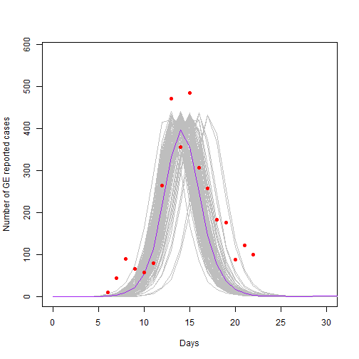

---
type: assignment
date: 2018-09-26T4:00:00+4:30
title: title: '5. Gün Final projesi: COVID-19'
pdf: /static_files/assignments/15_final_project_covid19.pdf
attachment: /static_files/assignments/daily_cases_countryX.csv
#solutions: /static_files/assignments/asg_solutions.pdf
due_event: 
    type: due
    date: 2018-11-13T23:59:00+3:30
    description: 'Assignment #1 due'
--- 
 
In this **final project** we will put in practice most of the concepts learnt so far in the course. By the end of this practical you should have been able to define and run a model for the transmission of SARS-CoV2, interpret its main output and simulate interventions.
 
## 1. An initial model for the transmission of SARS-CoV2
 
As chief of outbreak control of your country you have been asked to provide a projection of the likely population effect of COVID-19 for the next two years. Initial estimations of the main epidemiological indicators have been provided to you. See below:
 
-   Population size = 100,000
-   Estimated R0 = 1.4 to 3.9
-   Incubation period = 5.1 days
-   Fraction developing symptoms = 50%
-   Duration of infectious period = 2 to 7 days
-   Duration of acquired immunity = 1 year
 
It is understood that stochastic effects might have an important role in assessing the possible extinction or further growth of the epidemic.
 
**Task 1:** Using as template a previous SIR stochastic model, help re-arrange the necessary code to create and run an initial projection.
 
**Note:** The code below has been pre-adapted, but some gaps marked (with the symbol **??)** need to be filled for the code to run.
 


library(odin)
library(ggplot2)
library(reshape2)
library(dplyr)
library(here)
set.seed(1)
 
seir_generator <- odin::odin({
  ## Core equations for transitions between compartments:
  update(S) <- S - n_SE + n_RS + n_bd
  update(E) <- ?? #<-------------------We need an incubation compartment! 
  update(I) <- I + n_EI - n_IR
  update(R) <- R + n_IR - n_RS
  
  output(cases) <- n_EI * psymp
  ## Individual probabilities of transition:
  p_SE <- 1 - exp(-beta * I / N) # S to E
  p_EI <- 1 - exp(-omega)        # E to I
  p_IR <- 1 - exp(-gamma)        # I to R
  p_RS <- 1 - exp(-delta)        # R to S
  
  ## Draws from binomial distributions for numbers changing between compartments:
  n_SE <- rbinom(S, p_SE)
  n_EI <- rbinom(E, p_EI)
  n_IR <- rbinom(I, p_IR)
  n_RS <- rbinom(R, p_RS)  
  n_bd <- N*birth_rate/365
  
  ## Total population size
  N <- ?? #<- How do we define our total population ?
  
  # Define beta in R0 terms
  beta <- ?? #<- Re-define beta in terms of R0? (hint: what is the infectious duration rate?) 
 
  
  ## Initial states:
  initial(S) <- S_ini
  initial(E) <- E_ini
  initial(I) <- I_ini
  initial(R) <- 0
  
  ## User defined parameters - default in parentheses:
  S_ini <- user(1000)
  E_ini <- user(1)
  I_ini <- user(0)
  R0    <- user(2)
  gamma <- user(0.1)
  delta <- user(0.08)
  omega <- user(0.2)
  birth_rate <- user(0.0137)
  psymp <- user(0.5)
  
}, verbose = FALSE)

 
Now that you have defined your model, try creating a model object with some parameters, and run an initial projection.
 
**Task 2:** According to the information provided at the beginning define parameter values and run the model executing the code provided
 

 


N<-?? # Population size
 
# Call SEIR object with specific parameters 
seir <- seir_generator$new(
  S_ini=N-round(0.001*N), 
  E_ini = round(0.001*N), 
  R0= ??,    # R0
  gamma=??,  # Incubation period rate
  delta=??,  # Acquired immunity loss rate
  omega=??,  # Infectious period rate
  psymp=??)  # Fraction developing symptoms
 
 
## RUN THE MODEL 100 times
t_end<- 365 * 2 # simulation time (2 years)
seir_100 <- seir$run(0:t_end, replicate = 100)
 
# Plot cases
mean_cases <- rowMeans(seir_100[,"cases",])
matplot(seir_100[, "step",],seir_100[, "cases",], xlab = "Days", ylab = "Number of cases",
        type = "l", lty = 1, col="grey")
lines(seir_100[, "step",1],mean_cases,col="purple")
legend("topright", lwd = 1, col = "grey", legend = c("I"), bty = "n")

 

 
Now that you have produced an initial projection using an initial guess for parameter values, you are asked to tune your model to reflect epidemic curve data that has been provided to you for the first 30 days.
 
**Task 3:** Daily case data has been provided for this exercise. Look for the file named "daily_cases_countryX.csv" and place it in the "data" folder of your R project.
 
**Task 4:** Plot your model projection against the data. Use the code below to plot your latest model run against the data.
 


## Load case data (adapt file path to your specific environment)
case_data<-read.csv(here("data","daily_cases_countryX.csv"))
 
 
### Plot cases
mean_cases <- rowMeans(seir_100[,"cases",])
matplot(seir_100[, "step",],seir_100[, "cases",], xlab = "Days", ylab = "Number of cases",
        type = "l", lty = 1, col="grey")
lines(seir_100[, "step",1],mean_cases,col="purple")
points(case_data$day,case_data$cases,type = "p",col="black", pch=17)
legend("topright", lwd = c(1,NA), col = c("Purple","black"), legend = c("Mean cases","Data"), lty=c(1,NA),pch=c(NA,17),bty = "n")

 

 
You have a preliminary model simulation and some real data for the first 30 days. Now you have to try to reproduce the data with your model.
 
**Task 5:** Making variations (one at a time) of the parameters *R0* and duration of infectious period, explore running the model until you find something satisfactory.
 
**Note:** You might not get exactly the same model as plotted above. Also note that the peak is still uncertain so there is room for different combinations of parameters.
 
**Task 6:** Write down the set of parameters you have selected. Explain What you see in the graph, are there further peaks? is the epidemic fading out?
 
# 2. Introducing interventions to mitigate the spread of COVID-19
 
For this part of the project you will work in groups (no more than 3 people) to simulate a plan of interventions to reduce the spread of SARS-CoV2. A brief exposition of your results to the wider group will take place at the end.
 
## 2.1. Estimating the effect of sequential lockdowns
 
For this exercise you will have to design a strategy to of introducing lock-downs, with intervals of relaxations of measures, since you have been advised that a suppression scenario is not sustainable in your country.
 
**Task 7:** From the knowledge you have acquired so far can you explain what is the mechanism by which a lock-down has an effect on transmission? What components of the force of infection are being affected?
 
Now you will use the following pre-coded model to test your strategies. The code is complete you just have to copy and paste it in your own project.
 
*Technical Note: In our model, a lock down is introduced as a vector that multiplies beta. We do this by passing an interpolation function for which we have defined values in the axis y (from 0 to 1), and a vector x with the time steps to interpolate.*
 


## New model with lockdown
 
seir_generator2 <- odin::odin({
  ## Core equations for transitions between compartments:
  update(S) <- S - n_SE + n_RS + n_bd
  update(E) <- E - n_EI + n_SE
  update(I) <- I + n_EI - n_IR
  update(R) <- R + n_IR - n_RS
  
  output(cases) <- n_EI * psymp
  ## Individual probabilities of transition:
  p_SE <- 1 - exp(-beta * I / N) # S to I
  p_EI <- 1 - exp(-omega)
  p_IR <- 1 - exp(-gamma)        # I to R
  p_RS <- 1 - exp(-delta)        # R to S
  
  ## Draws from binomial distributions for numbers changing between
  ## compartments:
  n_SE <- rbinom(S, p_SE)
  n_EI <- rbinom(E, p_EI)
  n_IR <- rbinom(I, p_IR)
  n_RS <- rbinom(R, p_RS)  
  n_bd <- N*birth_rate/365
  ## Total population size
  N <- S + E + I + R
  
  # Lock-down (interpolation)
  lock_effect <- interpolate(lock_effect_t, lock_effect_y, "constant")
  
  # Define beta in R0 terms
  beta <- R0*omega*lock_effect
  
  
  ## Initial states:
  initial(S) <- S_ini
  initial(E) <- E_ini
  initial(I) <- I_ini
  initial(R) <- 0
  
  ## User defined parameters - default in parentheses:
  S_ini <- user(1000)
  E_ini <- user(1)
  I_ini <- user(0)
  R0    <- user(2)
  gamma <- user(0.1)
  delta <- user(0.08)
  omega <- user(0.2)
  birth_rate <- user(0.0137)
  psymp <- user(0.5)
  lock_effect_t[]   <- user()
  lock_effect_y[]   <- user()
  
  
  # Define dimensions
  dim(lock_effect_t)  <-user()
  dim(lock_effect_y)  <-user()
  
}, verbose = FALSE)

 
Now you have created the engine to create a model that allows lock-downs. So let's create one.
 
The following code is ready to use. Take a moment to understand what it is doing and copy and paste in your script. (read the comments!). Below is a function that will help you create a lockdown vector to pass to your model.
 


# Create lock-down function: You will call this function every time you design a new lock-down
 
get_lockdown<-function(x,reduction,start_lockdown, duration){
  y<-x*0 + 1
  for (ii in 1:length(start_lockdown)){
    
    y[start_lockdown[ii]:(start_lockdown[ii]+duration)]<-1-reduction
    
  }
  return(y)
}

 
For any lock-down intervention we design we will need to provide a vector of times when restrictions start, the duration of each restriction, and the effect that the restriction will have on transmission. As you can imagine, it is hard to establish a lock down effect *a priori*, but let us think of this as the strictness of lock-down, where 0.9 is, for example, a very stringent shut down (close schools, close public places, close work) and 0 is no lock-down at all. Use the code below to create an initial lock dowm. (just copy and execute the code)
 


# Create a lockdown 
effect<-0.6 # Reduction in transmission (or strictness of strategy 1=most strict)
starts<- c(30,250,600) # starting dates of each lock down (at which day)
duration<-60 # duration in days of each lock-down
 
# time vector
x <- seq(1:t_end) 
# call lock down function
yy<- get_lockdown(x,reduction=effect,starts,duration) 
 
# plot to visualize your strategy 
plot(x,yy,type="l") 


 
Look carefully at the plot and understand what is being plotted. Think of it as windows of relaxation (equals 1), followed by restriction (\<1).
 
Now use this lock-down in your SEIR model. Look a the code below, explore it and copy and paste it
 


# Seed for random numbers
set.seed(1)
N<-100000
 
# Call NEW SEIR object
seir <- seir_generator2$new(
  S_ini=N-round(0.001*N), 
  E_ini = round(0.001*N), 
  R0=2.2, 
  gamma=1/5.1, 
  delta=1/365, 
  omega=1/3, 
  psymp=0.5,
  lock_effect_t=x,  # <--- Note that we pass new parameters for lock down  
  lock_effect_y=yy) # <--- Note that we pass new parameters for lock down 
 
# Run the new model 100 times 
seir_100 <- seir$run(1:t_end, replicate = 100)
 
### Plot cases against data and lock down plan
mean_cases <- rowMeans(seir_100[,"cases",])
matplot(seir_100[, "step",],seir_100[, "cases",], xlab = "Days", ylab = "Number of cases",
        type = "l", lty = 1, col="grey")
lines(seir_100[, "step",1],mean_cases,col="purple")
points(case_data$day,case_data$cases,type = "p",col="black", pch=17)
legend("topright", lwd = c(1,NA), col = c("Purple","black"), legend = c("Mean cases","Data"), lty=c(1,NA),pch=c(NA,17),bty = "n")
par(new = TRUE)
plot(x, yy, type = "l", axes = FALSE, bty = "n", xlab = "", ylab = "")
axis(side=4, at = pretty(range(yy)))
mtext("z", side=4, line=3)


 
**Task 8:** Using this code, design your own plan of intervention. Use the following tips:
 
-   Remember that the object *starts* contains the day when each new restriction applies. You can create as many lockdown as you want as long as they fall within the period of the simulation (starting at day 30, which is were we are, and ending at 730 - end of second year).
-   The *duration* value in days MUST be less than the interval between restrictions in *starts*
-   Give a meaningful explanation to the effect parameter. This is, if you select en effect of 0.8 (80% reduction in transmission) give an example of what restrictions (e.g., schools closed, transport etc) you imagine could give you that effect.
 
**Task 9:** Plot your intervention
 
**Task 10:** How many new infections have you averted (prevented) ?: To estimate cases averted over a period of time we use the cumulative sum of cases over time. You will need to run a baseline model (counter-factual scenario) to estimate how many cumulative cases you will have by the end of year 2 if you do NOTHING. Then, run your lock-down model and estimate the cumulative cases. The difference between the two are yur averted cases. (Use the code below)
 
*Hint:* To run a baseline model you just need to set the lock down effect to 0
 


#estimate cumulative cases
cumcases<-cumsum(mean_cases)
 
#cumulative at end of year 2
cumcases[730]



## [1] 97011.02

 
**Task 11:** Think of vaccination: It is out of the scope of the practical to run a code for vaccination, but we can certainty start thinking how a model structure would look. With your group think about how would you model vaccination in a SEIR model. Draw the model structure and note what extra paramateres we will need. ( *remember there are many ways you can do this so just be creative!* )
 
**Task 12:** Report back to the group: in a very brief presentation (max,. 5 minutes) you will present the following: 1. A baseline model projection (mention what parameters you used (e.g, R0, gamma, etc)) 2. Present your lock-down plan with frequencies and effect. Explain how this effect correlates to real-life restrictions 3. Present a model with lock-down interventions in, and the estimated impact in cases averted) 4. Show a schematic of a model structure for a SEIR model with vaccination.
